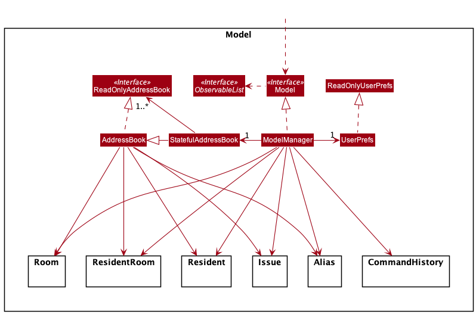
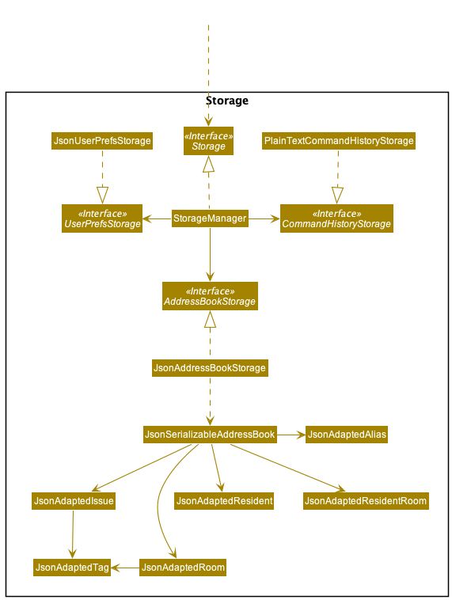
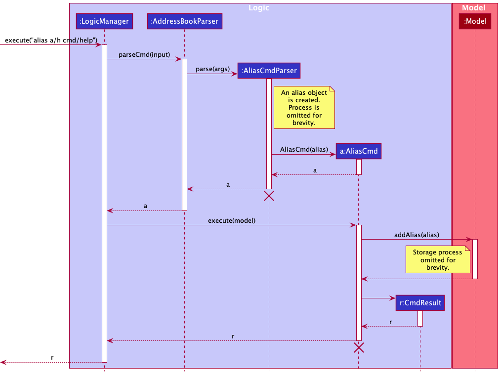
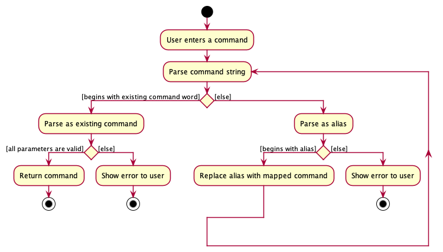
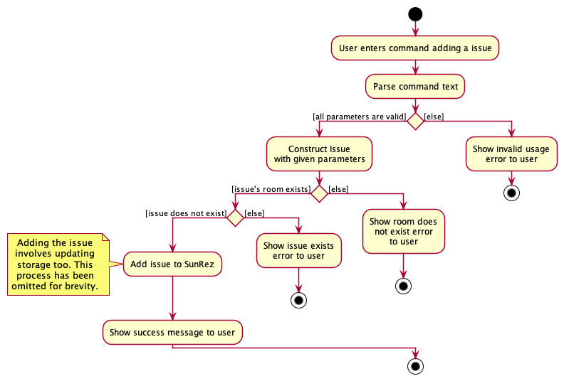
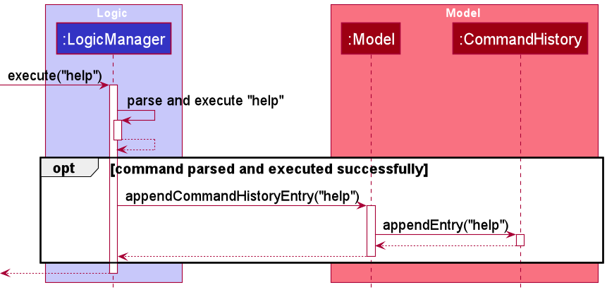
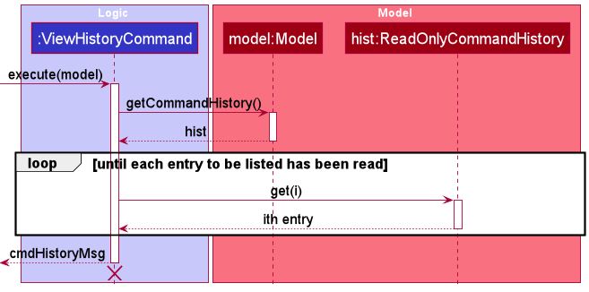

* Table of Contents
{:toc}

--------------------------------------------------------------------------------------------------------------------

## **Setting up, getting started**

Refer to the guide [_Setting up and getting started_](SettingUp.md).

--------------------------------------------------------------------------------------------------------------------

## **Design**

### Architecture

The ***Architecture Diagram*** given above explains the high-level design of the App. Given below is a quick overview of each component.

:bulb: **Tip:** The `.puml` files used to create diagrams in this document can be found in the [diagrams](https://github.com/se-edu/addressbook-level3/tree/master/docs/diagrams/) folder. Refer to the [_PlantUML Tutorial_ at se-edu/guides](https://se-education.org/guides/tutorials/plantUml.html) to learn how to create and edit diagrams.

**`Main`** has two classes called [`Main`](https://github.com/se-edu/addressbook-level3/tree/master/src/main/java/seedu/address/Main.java) and [`MainApp`](https://github.com/se-edu/addressbook-level3/tree/master/src/main/java/seedu/address/MainApp.java). It is responsible for,
* At app launch: Initializes the components in the correct sequence, and connects them up with each other.
* At shut down: Shuts down the components and invokes cleanup methods where necessary.

[**`Commons`**](#common-classes) represents a collection of classes used by multiple other components.

The rest of the App consists of four components.

* [**`UI`**](#ui-component): The UI of the App.
* [**`Logic`**](#logic-component): The command executor.
* [**`Model`**](#model-component): Holds the data of the App in memory.
* [**`Storage`**](#storage-component): Reads data from, and writes data to, the hard disk.

Each of the four components,

* defines its *API* in an `interface` with the same name as the Component.
* exposes its functionality using a concrete `{Component Name}Manager` class (which implements the corresponding API `interface` mentioned in the previous point.

For example, the `Logic` component (see the class diagram given below) defines its API in the `Logic.java` interface and exposes its functionality using the `LogicManager.java` class which implements the `Logic` interface.

**How the architecture components interact with each other**

The *Sequence Diagram* below shows how the components interact with each other for the scenario where the user issues the command `delete 1`.

The sections below give more details of each component.

### UI component

**API** :
[`Ui.java`](https://github.com/se-edu/addressbook-level3/tree/master/src/main/java/seedu/address/ui/Ui.java)

The UI consists of a `MainWindow` that is made up of parts e.g.`CommandBox`, `ResultDisplay`, `PersonListPanel`, `StatusBarFooter` etc. All these, including the `MainWindow`, inherit from the abstract `UiPart` class.

The `UI` component uses JavaFx UI framework. The layout of these UI parts are defined in matching `.fxml` files that are in the `src/main/resources/view` folder. For example, the layout of the [`MainWindow`](https://github.com/se-edu/addressbook-level3/tree/master/src/main/java/seedu/address/ui/MainWindow.java) is specified in [`MainWindow.fxml`](https://github.com/se-edu/addressbook-level3/tree/master/src/main/resources/view/MainWindow.fxml)

The `UI` component,

* Executes user commands using the `Logic` component.
* Listens for changes to `Model` data so that the UI can be updated with the modified data.

### Logic component

**API** :
[`Logic.java`](https://github.com/se-edu/addressbook-level3/tree/master/src/main/java/seedu/address/logic/Logic.java)

1. `Logic` uses the `AddressBookParser` class to parse the user command.
1. This results in a `Command` object which is executed by the `LogicManager`.
1. The command execution can affect the `Model` (e.g. adding a person).
1. The result of the command execution is encapsulated as a `CommandResult` object which is passed back to the `Ui`.
1. In addition, the `CommandResult` object can also instruct the `Ui` to perform certain actions, such as displaying help to the user.

Given below is the Sequence Diagram for interactions within the `Logic` component for the `execute("delete 1")` API call.

:information_source: **Note:** The lifeline for `DeleteCommandParser` should end at the destroy marker (X) but due to a limitation of PlantUML, the lifeline reaches the end of diagram.

### Model component

**API** : [`Model.java`](https://github.com/se-edu/addressbook-level3/tree/master/src/main/java/seedu/address/model/Model.java)

The `Model`,

* stores a `UserPref` object that represents the user’s preferences.
* stores the address book data.
* exposes an unmodifiable `ObservableList<Person>` that can be 'observed' e.g. the UI can be bound to this list so that the UI automatically updates when the data in the list change.
* does not depend on any of the other three components.

:information_source: **Note:** An alternative (arguably, a more OOP) model is given below. It has a `Tag` list in the `AddressBook`, which `Person` references. This allows `AddressBook` to only require one `Tag` object per unique `Tag`, instead of each `Person` needing their own `Tag` object. 

### Storage component

**API** : [`Storage.java`](https://github.com/se-edu/addressbook-level3/tree/master/src/main/java/seedu/address/storage/Storage.java)

The `Storage` component,
* can save `UserPref` objects in json format and read it back.
* can save the address book data in json format and read it back.

### Common classes

Classes used by multiple components are in the `seedu.addressbook.commons` package.

--------------------------------------------------------------------------------------------------------------------

## **Implementation**

This section describes some noteworthy details on how certain features are implemented.

### Alias feature
The `Alias` feature allows users to define a shortcut for a longer command that is often used. The longer command can then be executed by entering the alias instead of the full or partial command.

#### Implementation 
User-defined `Alias` is stored in `AliasMapping` within `UserPrefs`. `AliasMapping` internally uses `HashMap<String, Alias>` to store the mapping between the name of an `Alias` object and itself. With `AliasMapping` included in `UserPrefs`, `UserPrefs` supports the following methods:

* `UserPrefs#getAliasMapping()` — Returns the current `AliasMapping`.

* `UserPrefs#setAliasMapping(AliasMapping aliasMappings)` — Sets the current mapping to the specified mapping.

* `UserPrefs#addAlias(Alias alias)` — Adds a user-defined `Alias` to the current mapping.

* `UserPrefs#getAlias(String aliasName)` — Returns an `Alias` based on alias name.

* `UserPrefs#containsAlias(String aliasName)` — Checks if the current mapping contains an `Alias` based on alias name.

* `UserPrefs#isReservedKeyword(String aliasName)` — Checks if the alias name is a reserved keyword. This prevents users from using existing commands as alias name.

* `UserPrefs#isRecursiveKeyword(String commandWord)` — Checks if the command word is a recursive keyword. This prevents users from chaining aliases.

#### Alias creation
User can create a new `Alias` via the `AliasCommand`. The sequence diagram below describes how an `Alias` is created.

#### Alias execution

When a user executes a new command, `AddressBookParser` will follow these steps:

1. If the input begins with an existing command word, parse it as one of those pre-defined command.
    1. If all parameters are valid, return the corresponding `Command` object.
    1. Else show error to the user.
1. Else if the input begins with a mapped `Alias`, replace the alias with the mapped `Command`.
    1. Parse the mapped `Command` as per normal.
1. Else show error to the user.

The following diagram illustrates the flow:

### Room Features

The Room family of features consist of the following features: Add Room, Edit Room, List Rooms, Find Room and Delete Room. 

#### The Room Class
The Room class consists of 4 fields, each of which contain their own methods to verify their respective input. This allows for a low degree of coupling, and individual fields can change their input verification rules without affecting the other classes. Similarly, the Room class can expand to contain more fields without affecting existing fields too.

Examples of verification functions in each of the fields include `RoomNumber#isValidRoomNumber()`, `RoomType#isValidRoomType()`, etc.

The `Room` objects are stored in a `UniqueRoomList` which is held by `AddressBook`.  

##### Alternatives considered
* **Alternative 1 (current choice):** Abstract fields of Room out as separate classes
    * Pros:
        * Each field can take care of its own validation
        * Updating a field does not update the Room class itself
    * Cons:
        * More classes to manage and individually track
        * Might be unintuitive to initially understand
* **Alternative 2:** Leave fields of Room as member variables of the Room class
    * Pros:
        * Everything is self-contained within the Room class, single source of "truth"
    * Cons
        * Field verification becomes a responsibility of the Room class which is not desirable (Violation of SRP)
        * Changes to individual fields would impact the Room class which may unintentionally break other things
        * Less object oriented approach which goes against the principles of how this project was set up

#### Add Room
This section will detail the implementation of the Add Room feature via the `oadd` command,

##### Overview of Insertion Process 
The AddRoomCommand is triggered through the use of `oadd` followed by valid parameters such as room number, type, etc. The entire command string must then be parsed to extract the parameters that were inserted, and if they are all valid, a Room object is constructed and added to the model and saved to the backing store. Upon successful insertion, a feedback message is displayed to the user. 

This process is summarised in the diagram below

##### AddRoomCommand
The `AddRoomCommand` inherits from the `Command` object and overrides the `execute()` method. It checks if the model already has the room being inserted, and if it does not, it will insert the room.

The inheritance from `Command` allows `Logic` to deal with and manipulate polymorphic `Command` objects without dealing with the specific implemetations of each `Command` object.

##### Detailed execution pathway
The diagram below details how the user's command to add a room propagates through the system to eventually add a room. 

### Issue Features

The Issue family of features consist of the following features: Add Issue, Edit Issue, List Issue, Find Issue, Delete Issue and Close Issue.

#### The Issue Class

The Issue class consists of 5 fields, each of which contain their own methods to verify their respective input. This allows for a low degree of coupling, and individual fields can change their input verification rules without affecting the other classes. Similarly, the Issue class can expand to contain more fields without affecting existing fields too.

Examples of verification functions in each of the fields include `Category#isValidCategory()`, `Status#isValidStatus()`, etc.

The `Issue` objects are stored in an `IssueList` which is held by `AddressBook`.

#### Add Issue

This section will detail the implementation of the Add Issue feature via the `iadd` command.

##### Overview of Insertion Process

The AddIssueCommand is triggered through the use of `iadd` followed by valid parameters such as room number, description, etc. The entire command string must then be parsed to extract the parameters that were inserted, and if they are all valid, an Issue object is constructed and added to the model and saved to the backing store. Upon successful insertion, a feedback message is displayed to the user.

This process is summarised in the diagram below

##### AddIssueCommand

The `AddIssueCommand` inherits from the `Command` object and overrides the `execute()` method.

The inheritance from `Command` allows `Logic` to deal with and manipulate polymorphic `Command` objects without dealing with the specific implemetations of each `Command` object.

##### Detailed execution pathway
The diagram below details how the user's command to add an issue propagates through the system to eventually add an issue.

### Command History Feature
The command history feature has a few sub-features:
1. View history command: the user can list the command history.
1. Navigate history: the user can navigate their command history like in a terminal program.
1. Save/load history: command history persists across SunRez runs.

This section starts with an overview of the command history model then looks at each sub-feature in turn.

#### Implementation

##### Command History Overview
SunRez command history is represented by a `CommandHistory`, stored in the `ModelManager`. A `CommandHistory` is 
composed of zero or more `CommandHistoryEntry` objects, each representing a previously entered command. New entries
can be appended to `CommandHistory`. `CommandHistory` implements the `ReadOnlyCommandHistory` interface, 
which provides a non-editable view of the implementing `CommandHistory`; this readonly view is used by other components
that do not need to append to the command history. For example, the view history command reads it to display it - or a 
filtered portion of it - to the user.

The following class diagram shows an overview of the command history subsystem and its relation to other components.

##### How Command History is Updated
`Logic#execute()` triggers the update. Only _after_ a command parses and executes successfully will that command's text 
be appended to the command history via `Model#appendCommandHistoryEntry()`. If either parsing or execution fails,
then `CommandHistory` will be unchanged. The following sequence diagram shows this process pictorially using the 
example command `help`.

:information_source: 
**Note:** In the sequence diagram above, `parseAndExecute()` is not an actual method; rather it is a simplification
of a two-step process in the Logic component. The important thing to note is that `CommandHistory` is updated only
_after_ a command is parsed and executed successfully by the Logic component.

##### View History
SunRez allows the user to list the full command history, or a portion of it, through the command `history [COUNT]` where
`[COUNT]` is an optional integer that the user can specify to limit the number of most-recent entries to be listed.
If `[COUNT]` is omitted, then the full command history is displayed.

Viewing command history is implemented through `ViewHistoryCommand` and supported by `ReadOnlyCommandHistory`. 
`ViewHistoryCommand#execute()` accesses command history through the view of a `ReadOnlyCommandHistory`, reads the 
entries it needs to display, formats the entries into a message, then finally returns the message wrapped in 
a `CommandResult`, to be displayed to the user. The following sequence diagram illustrates the main interactions
between `ViewHistoryCommand` and the Model component. It uses the example command of `history 5`. 

##### Navigate History
The user navigates their command history via the UP and DOWN arrow keys. The UP and DOWN arrow keys respectively 
select the previous and next commands in history, if any.

The UP and DOWN key press events are first handled by `CommandBox` in the UI component. `CommandBox` delegates the 
logic of navigation and keeping track of state (which command we are selecting) to a `CommandHistorySelector`.
The `CommandHistorySelector` is called via `#selectNext()` and `#selectPrevious()` which are expected
to respectively return the next and previous commands in history since they were last called. Upon receiving the 
relevant commands from `CommandHistorySelector`, `CommandBox` will populate its text box with that command's text.
The following sequence diagram shows the aforementioned relationships.

`CommandHistorySelector#selectLast()` can also be called to reset the selection to the most recent command in history.
This is useful, for example, when a user has navigated to the middle of their command history then executes a new 
command. At this point, we want navigation to start from the most recent command again - not where the user was
before he/she executed a command.

Currently, SunRez uses a `SuppliedCommandHistorySelector` as its `CommandHistorySelector`. This implementation uses
a `Supplier<ReadOnlyCommandHistory>` to view SunRez command history whenever it is called to select a new entry.

##### Save/Load History
SunRez automatically saves command history after each command execution, and loads command history (if any) upon app 
start-up. The command history is saved in a plain-text file at `[JAR_file_location]/data/commandhistory.txt`. 

Saving and loading is supported by `CommandHistoryStorage`, an interface that exposes read and write methods. SunRez
currently uses an implementation of this interface called `PlainTextCommandHistoryStorage`, which serializes each
command history entry as a single line of plain text in the command history file. The class structure is shown 
in the class diagram in the _Command History Overview_ subsection above.

Command history is saved immediately after it is updated. `CommandHistoryStorage` creates a serialized string from
a `ReadOnlyCommandHistory` view of the command history, then writes it to disk using `FileUtil#writeToFile()` as a
helper. The following sequence diagram shows a simplified view of the storage process from command execution to 
writing the command history to file. For brevity, `FileUtil` is not shown, and the details of appending a command 
history entry are abbreviated to `appendCommandHistoryEntry("help")` because they are detailed in the subsection 
_How Command History is Updated_ above.

#### Design Considerations

##### Aspect: Should history include invalid commands?

* **Alternative 1 (current choice):** Only record valid commands (commands which parse and execute successfully).
    * Pros:
        * Less cluttered command history.
        * A User can still easily correct typos in a failed command because SunRez does not consume the input if it 
          fails to execute.
    * Cons: 
        * Behaves less like a regular shell program, so the user might be expecting different behavior.

* **Alternative 2:** Record all command text that the user tries to execute.
    * Pros:
        * Behaves more like a regular shell program.
    * Cons: 
        * More cluttered command history.
        * Arguably does not help the user correct typos in failed commands (see Alternative 1: Pros).

##### Aspect: Should command history selection logic be in `CommandBox`?

* **Alternative 1 (current choice):** No, abstract it out to an interface `CommandHistorySelector` with a backing 
  implementation.
    * Pros:
        * Follows SRP because `CommandBox` is part of the UI component, but history selection is logic. If selection
        logic is left in `CommandBox`, then it now has two reasons (UI and logic) to change.
        * Easier to unit test because logic is separated from UI.
    * Cons:
        * More complex to implement: one additional interface and class.

* **Alternative 2:** Yes, keep the selection logic in `CommandBox`.
    * Pros:
        * Simpler to implement: no additional classes or interfaces; and the selection logic is quite straightforward,
          so the bloat may be acceptable in the short term.
        * Arguably, selection only affects the `CommandBox` so the added complexity may not be worth it.
    * Cons:
        * Harder to unit test because selection logic is bundled with UI.
        * Pollutes a UI component with details of logic. If we wish to change the selection logic in future but not
          the UI, `CommandBox` will still need to change.

### \[Proposed\] Undo/redo feature

#### Proposed Implementation

The proposed undo/redo mechanism is facilitated by `VersionedAddressBook`. It extends `AddressBook` with an undo/redo history, stored internally as an `addressBookStateList` and `currentStatePointer`. Additionally, it implements the following operations:

* `VersionedAddressBook#commit()` — Saves the current address book state in its history.
* `VersionedAddressBook#undo()` — Restores the previous address book state from its history.
* `VersionedAddressBook#redo()` — Restores a previously undone address book state from its history.

These operations are exposed in the `Model` interface as `Model#commitAddressBook()`, `Model#undoAddressBook()` and `Model#redoAddressBook()` respectively.

Given below is an example usage scenario and how the undo/redo mechanism behaves at each step.

Step 1. The user launches the application for the first time. The `VersionedAddressBook` will be initialized with the initial address book state, and the `currentStatePointer` pointing to that single address book state.

Step 2. The user executes `delete 5` command to delete the 5th person in the address book. The `delete` command calls `Model#commitAddressBook()`, causing the modified state of the address book after the `delete 5` command executes to be saved in the `addressBookStateList`, and the `currentStatePointer` is shifted to the newly inserted address book state.

Step 3. The user executes `add n/David …​` to add a new person. The `add` command also calls `Model#commitAddressBook()`, causing another modified address book state to be saved into the `addressBookStateList`.

:information_source: **Note:** If a command fails its execution, it will not call `Model#commitAddressBook()`, so the address book state will not be saved into the `addressBookStateList`.

Step 4. The user now decides that adding the person was a mistake, and decides to undo that action by executing the `undo` command. The `undo` command will call `Model#undoAddressBook()`, which will shift the `currentStatePointer` once to the left, pointing it to the previous address book state, and restores the address book to that state.

:information_source: **Note:** If the `currentStatePointer` is at index 0, pointing to the initial AddressBook state, then there are no previous AddressBook states to restore. The `undo` command uses `Model#canUndoAddressBook()` to check if this is the case. If so, it will return an error to the user rather
than attempting to perform the undo.

The following sequence diagram shows how the undo operation works:

:information_source: **Note:** The lifeline for `UndoCommand` should end at the destroy marker (X) but due to a limitation of PlantUML, the lifeline reaches the end of diagram.

The `redo` command does the opposite — it calls `Model#redoAddressBook()`, which shifts the `currentStatePointer` once to the right, pointing to the previously undone state, and restores the address book to that state.

:information_source: **Note:** If the `currentStatePointer` is at index `addressBookStateList.size() - 1`, pointing to the latest address book state, then there are no undone AddressBook states to restore. The `redo` command uses `Model#canRedoAddressBook()` to check if this is the case. If so, it will return an error to the user rather than attempting to perform the redo.

Step 5. The user then decides to execute the command `list`. Commands that do not modify the address book, such as `list`, will usually not call `Model#commitAddressBook()`, `Model#undoAddressBook()` or `Model#redoAddressBook()`. Thus, the `addressBookStateList` remains unchanged.

Step 6. The user executes `clear`, which calls `Model#commitAddressBook()`. Since the `currentStatePointer` is not pointing at the end of the `addressBookStateList`, all address book states after the `currentStatePointer` will be purged. Reason: It no longer makes sense to redo the `add n/David …​` command. This is the behavior that most modern desktop applications follow.

The following activity diagram summarizes what happens when a user executes a new command:

#### Design consideration:

##### Aspect: How undo & redo executes

* **Alternative 1 (current choice):** Saves the entire address book.
  * Pros: Easy to implement.
  * Cons: May have performance issues in terms of memory usage.

* **Alternative 2:** Individual command knows how to undo/redo by
  itself.
  * Pros: Will use less memory (e.g. for `delete`, just save the person being deleted).
  * Cons: We must ensure that the implementation of each individual command are correct.

_{more aspects and alternatives to be added}_

### \[Proposed\] Data archiving

_{Explain here how the data archiving feature will be implemented}_

--------------------------------------------------------------------------------------------------------------------

## **Documentation, logging, testing, configuration, dev-ops**

* [Documentation guide](Documentation.md)
* [Testing guide](Testing.md)
* [Logging guide](Logging.md)
* [Configuration guide](Configuration.md)
* [DevOps guide](DevOps.md)

--------------------------------------------------------------------------------------------------------------------

## **Appendix: Requirements**

### Product scope

**Target user profile**:

Nina works as a housing service management officer for a Residential College* (in NUS). She is the sole manager of the office. She:
* has to manage a large number of residents and rooms (> 600)
* needs to efficiently assign rooms to residents
* handles room allocation exercise every semester
* needs to track room issues reported by students during the semester
* needs to update the issue lifecycle (reported => maintenance ongoing => fixed/closed)
* prefers typing over interacting via GUI

**Value proposition**: manage residents, rooms, and allocations faster than a typical GUI app.

### User stories

Priorities: High (must have) - `* * *`, Medium (nice to have) - `* *`, Low (unlikely to have) - `*`

| Priority | As a … | I want to … | So that I can…|
| - | - | - | - |
| `* * *` | new user | see usage instructions | refer to instructions if I forget how to use the app |
| `* * *` | confused user | have a help command | learn how to use the application |
| `* * *` | user | add a new person | |
| `* * *` | user | add issues | |
| `* * *` | user | see a list of pending tasks sorted by deadline | prioritise which to do |
| `* * *` | user | search for tasks | |
| `* * *` | user | close issues | focus on open issues |
| `* * *` | user | update issues | |
| `* * *` | user | remove issues | |
| `* * *` | user | add residents | |
| `* * *` | user | search for residents | |
| `* * *` | user | update resident details | ensure their information is up to date |
| `* * *` | user | remove residents | |
| `* * *` | user | add new rooms | |
| `* * *` | user | see a list of rooms with their statuses | know which rooms are available |
| `* * *` | user | search for rooms | |
| `* * *` | user | update room details | |
| `* * *` | user | remove rooms | |
| `* *` | user | see both available rooms and unassigned residents side by side | easily match residents to rooms |
| `* *` | careless user | undo previous commands | easily fix any errors I might make |
| `* *` | careless user | redo previous commands | easily fix an erroneous undo |
| `* * *` | user | allocate a resident to a room | |
| `* * *` | user | deallocate a resident from a room | |
| `* *` | power user | access my command history | efficiently repeat similar commands |
| `* *` | power user | access command history from previous sessions | easily reuse commands from previous sessions |
| `* *` | power user | create aliases for longer commands | avoid typing the same command multiple times |

## Use cases

(For all use cases below, the **System** is the `SunRez` and the **Actor** is the `user`, unless specified otherwise. All Use Cases are prefixed with `UC` followed by a 3 digit code)

### UC-001 Add a resident

**MSS**

1. User requests to add a specific resident to the list.
2. SunRez adds the resident and saves the changes.

Use case ends.

**Extensions**

* 1a. The resident's details are incorrectly formatted (e.g. phone number/email/year format does not conform, OR room number is invalid).
    * 1a1. SunRez displays an error stating which field is incorrectly formatted and requests the user to try again after fixing the stated error.
    
        Use case ends.
* 1b. The resident's phone number or email are in use by an existing resident.
    * 1b1. SunRez displays an error stating which field is already in use and requests the user to try again after fixing the stated error.
    
        Use case ends.
* 2a. SunRez encounters an error while saving the content.
    * 2a1. SunRez shows an error message and requests the user to try their command again.
    
        Use case ends.

### UC-002 List all residents

**MSS**

1. User requests to list residents.
2. SunRez shows a list of residents.

Use case ends.

**Extensions**

* 2a. The list is empty.
    
    Use case ends.

### UC-003 Find residents

**MSS**

1. User searches for a resident by keywords.
2. SunRez shows a list of residents whose name contain any of the keywords.

Use case ends.

**Extensions**

* 2a. There are no residents matching the keywords.
    * 2a1. An empty list is displayed.
    
        Use case ends.

### UC-004 Edit a resident record

**MSS**

1. User requests to list residents.
2. SunRez shows a list of residents.
3. User requests to edit a specific resident based on the index from the list displayed in step 2.
4. SunRez edits the residents and saves the changes.

Use case ends.

**Extensions**

* 2a. The list of residents is empty.
    
    Use case ends.
* 3a. The resident's details are invalid (e.g phone number/email/dob format does not conform, OR room number is invalid).
    * 3a1. SunRez shows an error message stating which field is incorrectly formatted and requests the user to try again.
    
        Use case resumes at step 2.

### UC-005 Delete a resident

**MSS**

1. User requests to list residents.
2. SunRez shows a list of residents.
3. User requests to delete a specific resident based on the index from the list displayed in step 2.
4. SunRez deletes the specified resident and saves the changes.

Use case ends.

**Extensions**

* 2a. The list of residents is empty.
    
    Use case ends.
* 3a. The specified resident does not exist.
    * 3a1. SunRez shows an error message.
    
        Use case resumes at step 2.

### UC-006 Add a room

**MSS**

1. User requests to add a specific room to the list.
2. SunRez adds the room and saves the changes.

Use case ends.

**Extensions**
* 1a. The room's details are invalid (e.g room number format is not valid).
    * 1a1. SunRez shows an error stating which field is incorrectly formatted and requests the user to try again after fixing the stated error.

        Use case ends.

### UC-007 List all rooms

Similar to *UC-002 List all residents*, just replace residents with rooms.

### UC-008 Find rooms

Similar to *UC-003 Find residents*, just replace resident with room.

### UC-009 Edit a room record

**MSS**

1. User requests to list rooms.
2. SunRez shows a list of rooms.
3. User requests to edit a specific room based on the index from the list displayed in step 2.
4. SunRez edits the room and saves the changes.

Use case ends.

**Extensions**

* 2a. The list of rooms is empty. 
    
    Use case ends.
* 3a. The room's details are invalid (e.g. room number format is not valid).
    * 3a1. SunRez shows an error message stating which field is incorrectly formatted and requests the user to try again.

        Use case resumes at step 2.

### UC-010 Delete a room

Similar to *UC-005 Delete a resident*, just replace resident with room.

### UC-011 Add an open issue

**MSS**

1. User requests to add a specific open issue to the list.
2. SunRez adds the issue and saves the changes.

Use case ends.

**Extensions**
* 1a. The issue's details are invalid (e.g. invalid room number).
    * 1a1. SunRez shows an error stating which field is incorrectly formatted and requests the user to try again after fixing the stated error. 

        Use case ends.

### UC-012 List all issues

Similar to *UC-002 List all residents*, just replace residents with issues.

### UC-013 Find issues

Similar to *UC-003 Find residents*, just replace residents with issues.

### UC-014 Edit an issue record

**MSS**

1. User requests to list issues.
2. SunRez shows a list of issues.
3. User requests to edit a specific issue based on the index from the list displayed in step 2.
4. SunRez edits the issue and saves the changes.

Use case ends.

**Extensions**

* 2a. The list of issue is empty.
    
    Use case ends.
* 3a. The issue's details are invalid (e.g invalid room number).
    * 3a1. SunRez shows an error message stating which field is incorrectly formatted and requests the user to try again.
    
        Use case resumes at step 2.

### UC-015 Close an issue

**MSS**

1. User requests to list issues.
2. SunRez shows a list of issues.
3. User requests to mark a specific issue as closed based on the index from the list displayed in step 2.
4. SunRez marks the issue as closed and saves the changes.

Use case ends.

**Extensions**

* 2a. The list is empty.

    Use case ends.
* 3a. The given index is invalid.
    * 3a1. SunRez shows an error message.

        Use case resumes at step 2.

### UC-016 Delete an issue

Similar to *UC-005 Delete a resident*, just replace resident with issue.

### UC-017 Undo Previous Command

**MSS**

1.  User requests to undo previous command.
2.  Previous command is undone and SunRez's state is reverted to before that command.

Use case ends.

**Extensions**

* 1a. There are no previous commands that change state.
    * 1a1 SunRez shows an error message.

        Use case ends.

### UC-018 Redo Previous Command

**MSS**

1.  User requests to redo previously undone command.
2.  Previous undone command is redone and SunRez's state is updated accordingly.

Use case ends.

**Extensions**

* 1a. There are no previously undone commands.
    * 1a1 SunRez shows an error message.

        Use case ends.

### UC-019 Allocate a Room

**MSS**

1. User requests to list unassigned residents and unallocated rooms.
2. SunRez displays unassigned residents and unallocated rooms side-by-side.
3. User requests to allocate a room to a resident.
4. SunRez allocates the room and saves the changes.

**Extensions**

* 2a. There are no unassigned residents or unassigned.
    
    Use case ends.
* 3a. The given index is invalid.
    * 3a1. SunRez shows an error message.

        Use case resumes at step 2.

### UC-020 Deallocate a Room

**MSS**

1. User requests to list room allocations.
2. SunRez displays rooms, each with its corresponding allocated resident.
3. User requests to deallocate a room based on the index from the list displayed in step 2.
4. SunRez deallocates the room and saves the changes.

**Extensions**

* 2a. There are no unassigned residents or unassigned.

    Use case ends.
* 3a. The given index is invalid.
    * 3a1. SunRez shows an error message.

        Use case resumes at step 2.

### UC-021 Access Command History

**MSS**

1. User requests to view command history.
2. SunRez displays command history, in reverse order of entry.
3. User selects a previously entered command.
4. SunRez fills the command field with the selected command.
5. User modifies and/or executes the command.

Use case ends.

**Extensions**

* 1a. There is no command history.

    Use case ends.

### UC-022 Add an alias

**MSS**

1. User wants to assign an alias name for a command.
2. SunRez validates the alias name and command.
3. SunRez saves the alias mapping to the user’s preferences.

Use case ends.

**Extensions**

* 1a. Alias name is invalid.
    * 1a1. SunRez shows an error message. 

        Use case ends.

* 2a. An alias with the same name exists.
    * 2a1. SunRez overwrites the existing alias. 

        Use case resumes from step 3.

## Non-Functional Requirements

1. Should work on any _mainstream OS_ as long as it has Java `11` or above installed.
2. Should be able to hold up to 1000 records (residents, rooms and issues) without a noticeable sluggishness in performance for typical usage.
3. A user with above average typing speed for regular English text (i.e. not code, not system admin commands) should be able to accomplish most of the tasks faster using commands than using the mouse.
4. A user should be able to learn the basic commands within half an hour of initial usage.
5. Should work without the internet.
6. Should be a highly portable to enable transfer between different computers with different OS.
7. Executable program should occupy less than 20MB on the computer.
8. Should not require an installer.
9. The data should not be stored in a Database Management System (DBMS).
10. Should not depend on any remote server.

*{More to be added}*

### Glossary

* **Mainstream OS**: Windows, Linux, Unix, OS-X
* **Residential College (RC)**: A university residence for students that offers a 2-year program at NUS
* **NUS**: The National University of Singapore
* **Resident**: A university student staying in the Residential College
* **Issue**: A maintenance problem that concerns the condition of a room

--------------------------------------------------------------------------------------------------------------------

## **Appendix: Instructions for manual testing**

Given below are instructions to test the app manually.

:information_source: **Note:** These instructions only provide a starting point for testers to work on;
testers are expected to do more *exploratory* testing.

### Launch and shutdown

1. Initial launch

   1. Download the jar file and copy into an empty folder

   2. Double-click the jar file Expected: Shows the GUI with a set of sample contacts. The window size may not be optimum.

2. Saving window preferences

   1. Resize the window to an optimum size. Move the window to a different location. Close the window.

   2. Re-launch the app by double-clicking the jar file. 
       Expected: The most recent window size and location is retained.

3. _{ more test cases … }_

### Saving data

1. Dealing with missing/corrupted data files

   1. _{explain how to simulate a missing/corrupted file, and the expected behavior}_

2. _{ more test cases … }_
